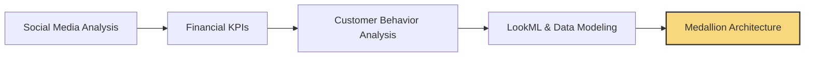

# Sergio Pestana | Data Explorer & Insights Architect

<div align="center">
  
  
  
  [](https://www.linkedin.com/in/sergio-luis-pestana/)
  [](mailto:serg.poa@gmail.com)
  
</div>

## 👨‍💻 Who Am I?

Data storyteller with a passion for uncovering hidden patterns and delivering actionable intelligence. With experience spanning from social media analytics to financial dashboards, I combine technical expertise with business acumen to solve complex problems.

```python
class SergioProfile:
    def __init__(self):
        self.name = "Sergio Pestana"
        self.role = "Senior Data Analyst"
        self.location = "New York, USA"
        self.background = "Economics + Data Science"
        self.skills = ["Data Modeling", "ETL Development", "ML Implementation", 
                      "Dashboard Creation", "Stakeholder Communication"]
        
    def current_focus(self):
        return "Building scalable data architectures in Databricks"
```

## 🚀 My Data Journey



## 🛠️ Technical Toolbox

<div align="center">
  
  | Category | Technologies |
  |----------|--------------|
  | **Languages & Query** |   |
  | **Data Platforms** |   |
  | **BI & Visualization** |    |
  | **Cloud & DevOps** |   |
  | **Data Engineering** |   |
  
</div>

## 🔍 Featured Projects


## 📚 Continuous Learning

I'm currently expanding my knowledge in:
- Advanced statistical methods through MITx's MicroMaster program
- ETL and data engineering
- Data mesh architecture principles

## 💡 Data Philosophy

> "The goal of data analysis isn't just to describe what happened, but to provide actionable insights that drive decision-making."

I believe in:
- Building data products that solve real business problems
- Maintaining rigorous data quality standards
- Communicating insights in accessible, impactful ways
- Continuous experimentation and learning

## 🤝 Let's Connect!

I'm always interested in collaborating on interesting data projects or discussing the latest trends in analytics.

- 📧 Email: [serg.poa@gmail.com](mailto:serg.poa@gmail.com)
- 🔗 LinkedIn: [sergio-luis-pestana](https://www.linkedin.com/in/sergio-luis-pestana/)
- 💻 GitHub: You're already here!

---

<div align="center">
  
</div>
